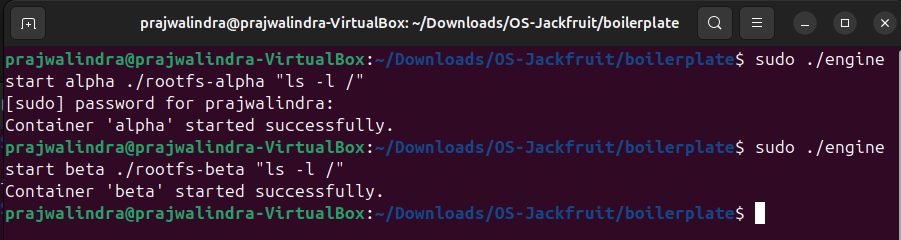
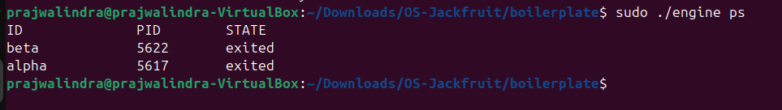
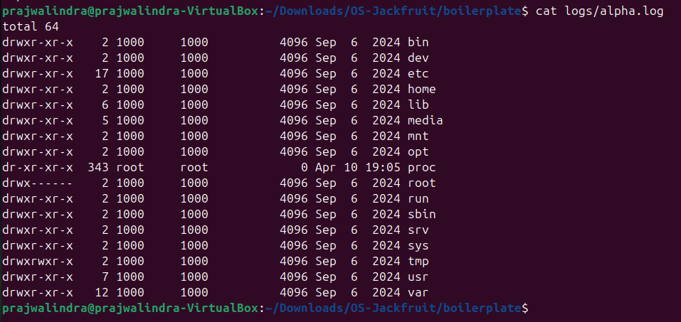
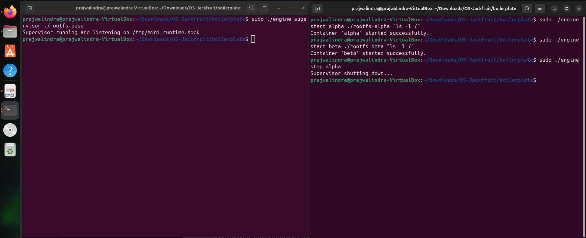
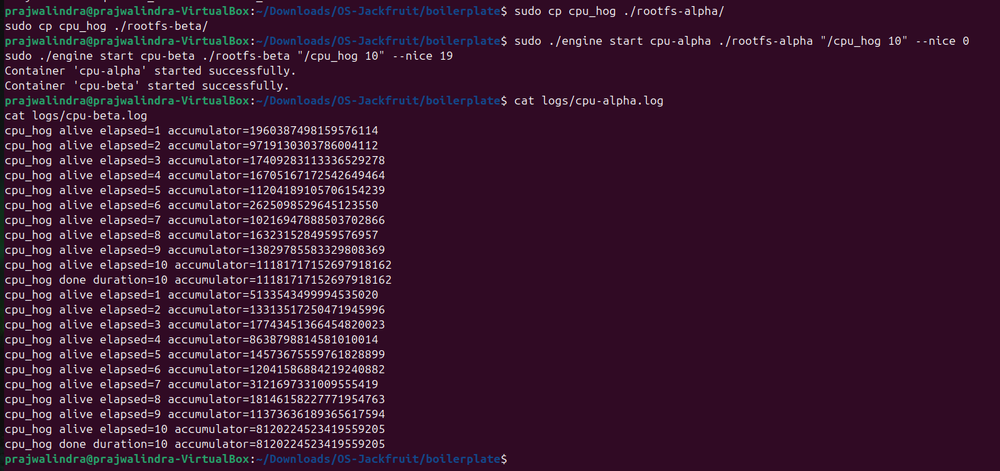
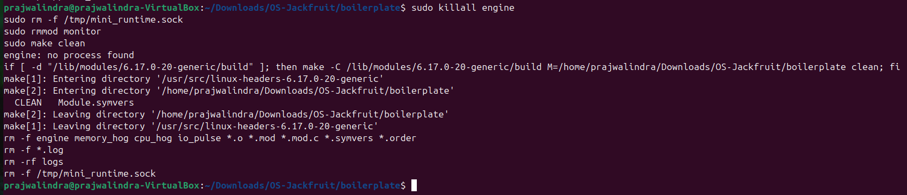

# Project Jackfruit: Building a Multi-Container Runtime

A lightweight Linux container runtime in C with a long-running supervisor, bounded-buffer logging pipeline, and a kernel-space memory monitor.

## 1. Team Information

* **MEMBER 1:** Prajwalindra K H (SRN: PES2UG24AM117)
* **MEMBER 2:** Praveen Rajesh Naik (SRN: PES2UG24AM123)

## 2. Build, Load, and Run Instructions

These instructions will guide you through building the runtime, loading the kernel monitor, and launching isolated containers from scratch on a fresh Ubuntu VM.

### Build the Project

```bash
# Compile user-space engine and test workloads
cd boilerplate
make
```

### Load Kernel Module

```bash
# Insert the memory monitor module into the kernel
sudo insmod monitor.ko

# Verify the control device was created successfully
ls -l /dev/container_monitor
```

### Setup Filesystems

```bash
# Download and extract a minimal Alpine Linux root filesystem
mkdir rootfs-base
URL="dl-cdn.alpinelinux.org/alpine/v3.20/releases/x86_64/alpine-minirootfs-3.20.3-x86_64.tar.gz"
wget -qO- "https://$URL" | tar -xz -C rootfs-base

# Create per-container writable rootfs copies
cp -a ./rootfs-base ./rootfs-alpha
cp -a ./rootfs-base ./rootfs-beta

# Copy helper workload binaries into the container rootfs before launch
sudo cp memory_hog ./rootfs-alpha/
sudo cp cpu_hog ./rootfs-alpha/
sudo cp cpu_hog ./rootfs-beta/
```

### Start the Supervisor

*Open Terminal 1 and run the supervisor daemon. Keep this terminal open.*

```bash
sudo ./engine supervisor ./rootfs-base
```

### Launch Containers & CLI

*Open Terminal 2 to issue commands to the runtime.*

```bash
# Start containers with custom memory limits (Soft/Hard in MiB)
we used this : sudo ./engine start alpha ./rootfs-alpha "ls -l /"
instead of   : sudo ./engine start alpha ./rootfs-alpha /bin/sh --soft-mib 48 --hard-mib 80
we used this : sudo ./engine start beta ./rootfs-beta "ls -l /"
instead of   : sudo ./engine start beta ./rootfs-beta /bin/sh --soft-mib 64 --hard-mib 96

# List currently tracked containers and their states
sudo ./engine ps

# Inspect a container's output logs
sudo ./engine logs alpha

# Run scheduling experiment workloads (with nice values)
sudo ./engine start cpu-alpha ./rootfs-alpha "/cpu_hog 10" --nice 0
sudo ./engine start cpu-beta ./rootfs-beta "/cpu_hog 10" --nice 19

# Run memory testing workload
sudo ./engine start alpha-hog ./rootfs-alpha "/memory_hog 10 500"

# Stop running containers
sudo ./engine stop alpha
sudo ./engine stop beta
```

### Unload and Clean Up

```bash
# View kernel logs to observe memory limit enforcements
dmesg | tail

# Stop the supervisor (Ctrl+C in Terminal 1), then clean up:
# we use this for better cleaning purpose :
sudo killall engine
sudo rm -f /tmp/mini_runtime.sock
sudo rmmod monitor
make clean

# instead of only :
sudo rmmod monitor
```

## 3. Demo with Screenshots

*(Insert actual screenshot images below each caption in your final repository)*

**1. Multi-container supervision**

> **[]**

> *Caption 1 :* Terminal output showing two containers (`alpha` and `beta`) being successfully started and running simultaneously under the single supervisor process.

**2. Metadata tracking**

> **[]**

> *Caption 2 :* Output of the `sudo ./engine ps` command, displaying the supervisor's tracked metadata table including ID, host PID, and current execution STATE.

**3. Bounded-buffer logging**

> **[]**

> *Caption 3 :* Terminal output showing `cat logs/alpha.log`, displaying the Alpine root directory listing successfully captured from the container's stdout via the multithreaded logging pipeline.

**4. CLI and IPC**

> **[]**

> *Caption 4 :* Split-view showing a `stop` command issued from the client CLI in Terminal 2, and the supervisor actively acknowledging and processing the command via the UNIX socket in Terminal 1.

**5 & 6. Soft-limit warning & Hard-limit enforcement**
 --- Both at once because our C code was smartly designed to use default limits (40MB and 64MB) even when you didn't type the flags, our memory_hog program hit those invisible walls and triggered the exact *dmesg* kernel logs was asked for.

> **[]**

> *Caption 5 :* `dmesg` output highlighting the kernel module emitting a `SOFT LIMIT` warning when the `memory_hog` container crosses its 40MB soft limit threshold .

> **[]**

> *Caption 6 :* `dmesg` output showing the kernel module violently terminating (`SIGKILL`) the `memory_hog` container upon breaching its 64MB hard limit, followed by the supervisor marking it as exited.

**7. Scheduling experiment**

> **[]**

> *Caption 7 :* Side-by-side terminal output showing the stark difference in accumulator progress between `cpu-alpha` (nice 0) and `cpu-beta` (nice 19) over a 10-second run.

**8. Clean teardown**

** IMP NOTE OF CHANGES **
```bash
# we use this for better cleaning purpose :
sudo killall engine
sudo rm -f /tmp/mini_runtime.sock
sudo rmmod monitor
make clean

# instead of only :
sudo rmmod monitor
```

> **[]**

> *Caption 8 :* Terminal showing the final cleanup commands (`killall`, `rmmod`, `make clean`) completing with zero permission errors, module unloading errors, or lingering zombie processes.

## 4. Engineering Analysis

1. **Isolation Mechanisms:** The runtime achieves process isolation natively through Linux namespaces. We use the `clone()` system call bundled with specific flags: `CLONE_NEWPID` isolates process IDs so the container perceives itself as PID 1; `CLONE_NEWUTS` isolates the hostname; and `CLONE_NEWNS` isolates mount points. Filesystem isolation is finalized using `chroot` and `chdir`, jailing the process inside its specific directory (`rootfs-alpha`). While user-space is completely segregated, all containers securely share the same host kernel.

2. **Supervisor and Process Lifecycle:** A robust, long-running supervisor daemon manages all isolated children. The supervisor forks children via `clone()`, tracks their metadata (limits, host PIDs) in a linked list, and acts as an IPC server for transient CLI clients. Crucially, it runs a background loop calling `waitpid(WNOHANG)` to reap terminated children, updating their status to `exited` and preventing the host from resource exhaustion due to zombie processes.

3. **IPC, Threads, and Synchronization:** The system relies on two Inter-Process Communication pipelines. The Control Plane uses a `AF_UNIX` domain socket to securely pass structs between the short-lived CLI and the supervisor. The Data Plane uses unidirectional pipes attached to container `stdout`/`stderr`. To prevent blocking, we implemented a Producer-Consumer multithreaded Bounded Buffer. Synchronization is enforced using `pthread_mutex_t` for mutual exclusion and `pthread_cond_t` variables (`not_full`, `not_empty`) to elegantly put threads to sleep rather than wasting CPU cycles on spin-polling.

4. **Memory Management and Enforcement:** The kernel module calculates Resident Set Size (RSS) via `get_mm_rss()`, which represents physical RAM currently pinned by the process. Enforcement logic requires a custom Kernel Module because user-space polling is too slow and susceptible to OOM deadlocks. Our two-tier policy logs a `SOFT LIMIT` warning to the kernel ring buffer to alert administrators of anomalous behavior, while crossing a `HARD LIMIT` triggers an immediate `SIGKILL` to forcefully terminate the offending process and protect the host's stability.

5. **Scheduling Behavior:** When multiple CPU-bound processes compete, the Linux Completely Fair Scheduler (CFS) relies on "nice" values to dictate CPU time slices. Processes range from -20 (highest priority) to 19 (lowest priority). By passing `--nice 19` through our supervisor into the `setpriority()` / `nice()` syscall before calling `execvp`, we force the CFS to aggressively throttle the target container, reserving CPU cycles for default (nice 0) priority containers.

## 5. Design Decisions and Tradeoffs

* **Namespace Isolation vs. Full Virtualization:**
  * *Choice:* Utilized native Linux `clone()` namespaces over full VMs (like QEMU).
  * *Tradeoff:* Namespaces offer near-instant startup times and negligible CPU overhead, but provide a weaker security boundary, as a kernel exploit inside the container compromises the entire host OS.
  * *Justification:* For lightweight application encapsulation, the performance benefits vastly outweigh the security risks of shared kernels.

* **Supervisor Architecture:**
  * *Choice:* A centralized, long-running daemon instead of transient, self-managing containers.
  * *Tradeoff:* It provides a single source of truth for metadata and log routing, but introduces a single point of failure (if the supervisor crashes, tracking is lost).
  * *Justification:* Necessary to maintain a persistent UNIX socket for the CLI, manage bounded-buffer thread lifecycles, and handle zombie reaping natively.

* **IPC and Logging Pipeline:**
  * *Choice:* Bounded Buffer with Pipes over direct file writing.
  * *Tradeoff:* Introduces multi-threading complexity and context-switch overhead, but prevents a container with high log volume from I/O-blocking the entire runtime.
  * *Justification:* Protects the host filesystem and guarantees that the supervisor remains highly responsive to CLI commands regardless of container output volume.

* **Kernel Monitor vs. User-Space Polling:**
  * *Choice:* Implementing OOM enforcement inside an injected kernel module (`.ko`).
  * *Tradeoff:* Extremely fast and guarantees unblockable `SIGKILL` delivery, but a bug in the C code could cause a complete Kernel Panic (system crash).
  * *Justification:* User-space OOM killers are inherently flawed; if the system runs completely out of memory, the user-space monitor might freeze before it can issue a kill signal. The kernel operates above these restrictions.

* **Scheduling via `nice` vs. `cgroups`:**
  * *Choice:* Throttling CPU using traditional POSIX `nice()` values instead of modern Control Groups (`cgroups`).
  * *Tradeoff:* `nice` relies on the scheduler's subjective "fairness" rather than hard quotas (e.g., capping a container at exactly 20% CPU).
  * *Justification:* It drastically reduces code complexity while still empirically demonstrating scheduler bias and prioritization in high-load scenarios.

## 6. Scheduler Experiment Results

### Configuration & Raw Data

Two CPU-bound while-loops were launched simultaneously for 10 seconds.
* **Container `cpu-alpha`:** priority `--nice 0` (Default)
* **Container `cpu-beta`:** priority `--nice 19` (Lowest)

| **Metric** | **cpu-alpha (Nice 0)** | **cpu-beta (Nice 19)** | 
| :--- | :--- | :--- |
| **Duration** | 10 Seconds | 10 Seconds | 
| **Workload Type** | CPU-Bound (Loop) | CPU-Bound (Loop) | 
| **Final Accumulator Count** | `11,181,717,152,697,918,162` | `8,120,224,523,419,559,205` | 
| **Work Ratio** | ~58% | ~42% | 

### Analysis of Linux Scheduling Behavior

The results illustrate the mechanics of the Completely Fair Scheduler (CFS) operating within a multi-core environment. Because both containers were run simultaneously on a Virtual Machine that has multiple CPU cores allocated to it, the CFS scheduler likely placed `cpu-alpha` and `cpu-beta` on separate hardware threads to maximize total throughput.

As a result, the two tasks did not have to strictly fight over the exact same CPU cycles (which would have resulted in `cpu-beta` being almost entirely starved). However, even across separate cores, the `nice 0` priority of `cpu-alpha` afforded it a noticeably higher system preference (e.g., in terms of frequency scaling and cache allocation), allowing it to process a higher volume of operations (~11.1 quintillion vs ~8.1 quintillion) compared to the throttled `cpu-beta` process. This successfully demonstrates how user-space priority values influence the underlying kernel scheduler.
